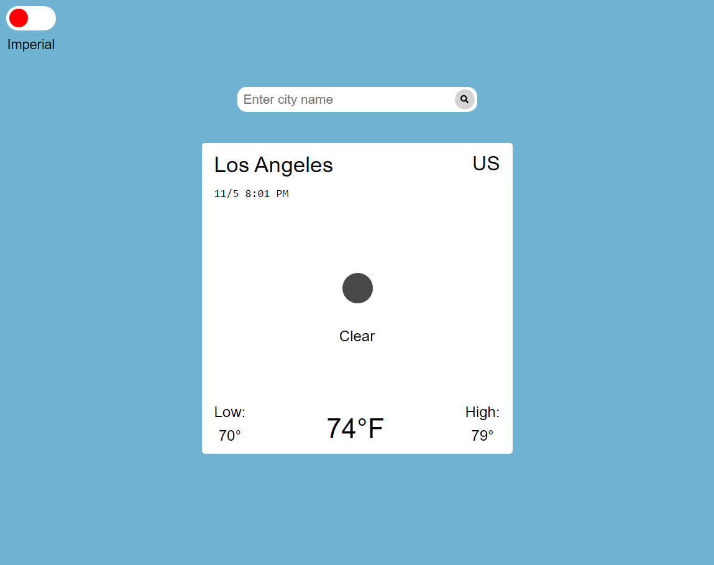

# Weather App

## Description

This weather application was created using ReactJS and create-react-app. It allows users to get the current temperature and weather condition at a specified city. The temperature can also be converted between degrees Fahrenheit and degrees Celsius. The purpose of this project was to gain familiarity in working with external APIs.

## 
